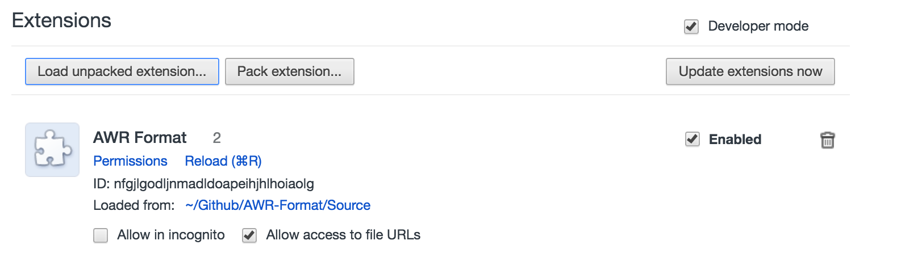

# AWR-Format
Copy of Tyler Muth AWR formatter

**Credits**: Tyler Muth

Refer to https://tylermuth.wordpress.com/2011/04/20/awr-formatter for more details. The uploaded version was not working on latest Chrome. 

After little modification, it started working. You can download the <kb>.crx</kb> file from this repository and add it to your local Chrome. 

## How to Install
1. Download the source folder in your local drive.
2. Go to Chrome Extensions (Tools -> Extensions) and enable developer mode.
3. Click load unpacked extensions and point it to the source folder as shown below

## Pending
1. Current version doesn't support RAC AWR reports
2. Current version can be extended further to document all wait events, latches etc.